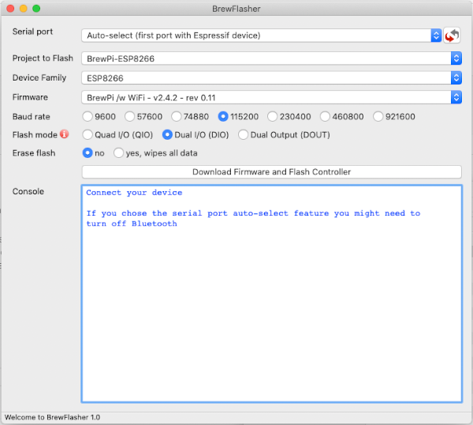

# BrewFlasher

A standalone desktop application for flashing brewing-related firmware to your ESP8266, ESP32, or ESP32-S2.

## About
BrewFlasher is a standalone desktop application that allows the user to flash specific firmware (upload software) to an 
ESP32, ESP32-S2, or ESP8266. It will automatically locate the firmware on the internet, download it, and flash it to 
your chip with minimal input required. Simple, fast, and magic.

This project was built as a natural complement to a handful of other projects I either support or collaborate on, where 
a user is expected to flash firmware to an ESP8266, ESP32, or ESP32-S2 controller. For many users, this step of the 
installation process is the most daunting - either because it requires the use of third-party tools that aren't 
mentioned in the project they want to use, requires the use of the command line, or - in some cases - isn't well 
explained at all. I solved this problem in my [Fermentrack](http://www.fermentrack.com/) project by building in a guided
"firmware flash" workflow - but this only helps when the user has installed Fermentrack. BrewFlasher was designed to 
take the best parts of the Fermentrack firmware flash workflow and integrate them into a standalone desktop application.

## Supported Firmware
BrewFlasher is designed to specifically support a handful of beer- and brewing-related projects for the ESP32, ESP32-S2,
or ESP8266. Those projects include:

- BrewPi-ESP (ESP32, ESP8266, and ESP32-S2)
- TiltBridge
- BrewBubbles
- Keg Cop
- Flite
- iSpindHub
- SBL4TILT
- GravityMon
- FermWatch
- BrewUNO

An up-to-date list of supported firmware can be found at the [BrewFlasher](https://www.brewflasher.com/about/supported_projects/) website.

If you have a beer- or brewing-related project you would like supported, raise an [issue](https://github.com/thorrak/brewflasher/issues) and we can discuss it. 

If you are looking to flash generic firmware, I recommend the [NodeMCU PyFlasher](https://github.com/marcelstoer/nodemcu-pyflasher) tool that BrewFlasher was based on. It works great for ESP8266 boards (and might work for some ESP32 boards as well)!

## Installation
BrewFlasher doesn't have to be installed; just double-click it and it'll start. BrewFlasher is available for both MacOS
and Windows.

## Manually toggling "Flash" Mode

For certain chips (e.g. ESP32-S2) the USB-to-serial functionality is provided by the controller itself rather than a 
separate piece of hardware. For these chips, you may be required to manually set the controller into "flash" mode before 
BrewFlasher can install new firmware. Below is the process for doing this for the Lolin S2 mini -- other controllers
are likely similar (though the "0" button may be labeled something else, like "boot" or "flash")

1. Plug the Lolin S2 Mini into your computer
2. Hold down the "0" button on the right of the board
3. While continuing to hold the "0" button, press the "RST" button on the left of the board
4. Wait several seconds, then release the "0" button
5. Flash your controller with the desired firmware
6. Manually press the "RST" button on the left of the board to reset the controller once flashing is complete

## Background & Development
BrewFlasher is based *heavily* on the [NodeMCU PyFlasher](https://github.com/marcelstoer/nodemcu-pyflasher) project. In 
comparison to that project, BrewFlasher adds explicit ESP32 & ESP32-S2 support as well as a workflow to automate selecting and
downloading brewing-related firmware to flash. The firmware selection is taken from a curated list maintained 
behind-the-scenes on BrewFlasher.com.

## License
This package was based on the NodeMCU PyFlasher project which is licensed under [MIT](http://opensource.org/licenses/MIT) 
license, the code for which is © Marcel Stör

All subsequent additions are additionally licensed under the [MIT](http://opensource.org/licenses/MIT) license and are 
© John Beeler

As noted in the license, BrewFlasher is provided without warranty of any kind. As when flashing any microcontroller,
a possibility of damage exists. Be careful, as all use of BrewFlasher is at your own risk. 
